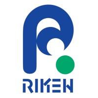
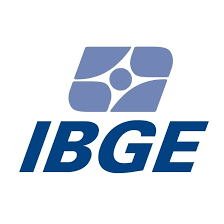

# Employments

-  *2024* **Internship** RIKEN-Center for Computational Science:
eeveloped a tool to predict hardware failures occurrences in the Fugaku supercomputer using Generative AI. Explored different classification models (XGBoost, Random Forest and Decision Tree).

-  *2023-present* **Research Assistant** Sandia National Laboratory: evaluated a tool to collect telemetry and I/O access information in large-scale systems. Performed characterization of the Fugaku supercomputer usage and analyzed the usage of energy savings mechanisms.

-  *2022* **Research Assistant** Argonne National Laboratory: evaluated the overhead and performance of Trusted Execution Environments (enclaves) for 9 distributed benchmarks exploring I/O, memory, CPU and network for AMD SEV (EPYC 7601) and AWS Nitro.

-  *2018/19* **Student Researcher** National Institute for Space Research: Parallelized a clustering algorithm with OpenACC, using 2xNVIDIA Tesla K80, achieving up to 48x speedup compared to the serial CPU-only. Developed a web portal for remote execution of the algorithms.

-  *2014* **Census Taker** Brazilian Institute of Geography and Statistics: interviewed the population for the Continuous National Household Sample Survey. 

----

# Volunteering

- *2022/21/20* **Chair** for the [PERMAVOST](https://permavost.github.io/2021.html) Workshop, in conjunction with the ACM HPDC conference
- *2022*       **Media Chair** for IEEE eScience 
- *2022*       **Artifacts Evaluator** of accepted papers for Supercomputing (SC)
- *2021/20*    **Student Lead Volunteer** for Supercomputing (SC) *during my MSCS in Brazil*
- *2018/19*    **Student Volunteer** for Supercomputing (SC) *during my BCS in Brazil*
- *2018/19*    **Instructor**, UniEscola: university project financed by the Brazilian National Council for Scientific and Technological Development(CNPq) to present STEM careers to female students at 5 schools located in Santa Maria, Brazil. We guided activities using Code.org for 54 students. 
- *2018/19*    **Mentor**, for middle school students participating in the [Brazilian Olympiad of Informatics](https://olimpiada.ic.unicamp.br).
- *2015/16/17/18* **Instructor**, Computing Club: university project to introduce computational thinking for K-12 students in the countryside of Brazil. We offered and organized free activities in the university and in 8 schools using Code.org, Blockly-Games, MIT App Inventor, and Studio Sketchpad (JavaScript).
- *2014* **Leader of Media** at the FIFA World Cup in Porto Alegre, Brazil 

