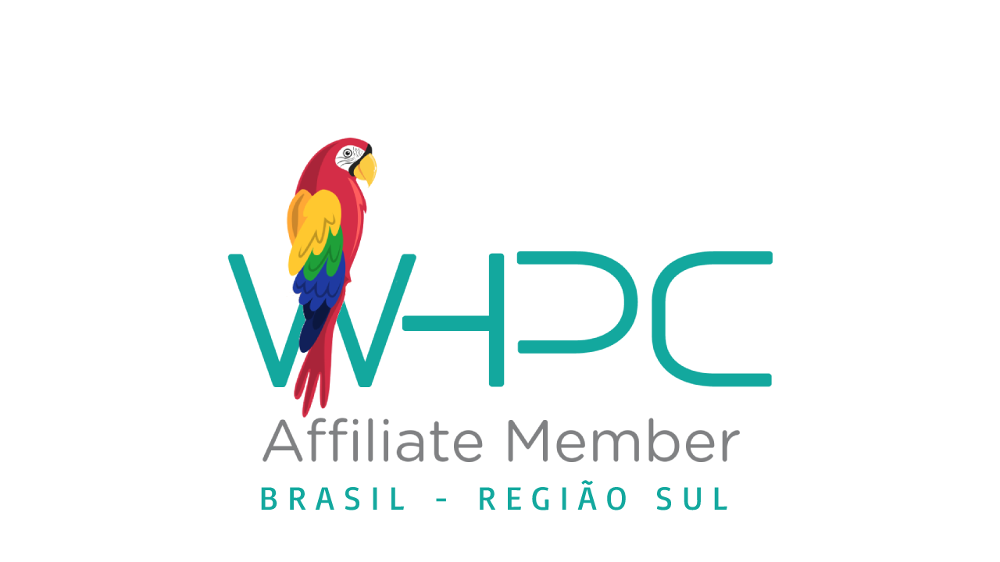
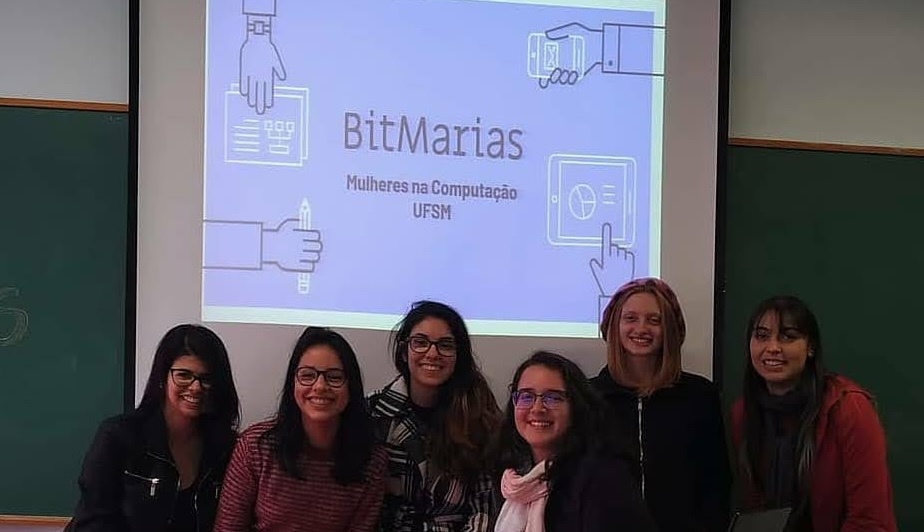

# Founder

## [Brazilians in Tech](http://braziliansintech.com)
 

Organization created in 2019 to to be a gateway opportunities and a community of Brazilian women in distinct fields in technology. Our community has more than 800 people subscribed from all the 26 states in Brazil, with more than 40 volunteers since we started. In our hub and newsletter, we share opportunities of jobs, internships and scholarships. In our social media and blog we give visibility to Brazilian women and their accomplishments. In the past, we oferred a free programming course in partnership with Kenzie Academy that that reached more than 4,400 women registered.

## [Women in HPC Affiliate, South of Brazil](https://medium.com/brazilians-in-tech/mulheres-em-computação-de-alto-desempenho-81cd045f9d5b)

 

Affiliate organization of the [Women in HPC](http://whpctransfer.wpenginepowered.com/membership/chapters-and-affiliates/map). The first official group for women in the field in Latin America. We organized activities to introduce the field of HPC to undergraduate students in Computer Science, created expert panels with female professors from Brazil, and participated in national and regional events.

## [BitMarias](https://www.instagram.com/bitmarias/)

The first group of women in Computer Science, Systems and Engineering at the Federal University of Santa Maria, located in Rio Grande do Sul, Brazil. Officially recognized by the university's Computer Science department, BitMarias is a group to assist women and underrepresented students, to foster a sense of community, and to inspire girls to pursue careers in computing through participation in university fairs and outreach initiatives.

More about it (Portuguese): [Grupo da UFSM fomenta a participação feminina na computação](https://www.ufsm.br/unidades-universitarias/ct/2019/12/18/grupo-da-ufsm-fomenta-a-participacao-feminina-na-computacao)