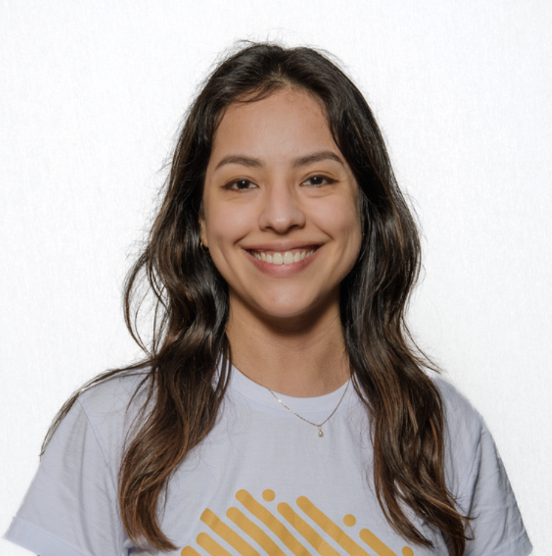

## Hi, I'm Ana!

I am Ana Veroneze Solórzano, a Brazilian-Peruvian researcher, computer scientist and leader of [Brazilians in Tech](https://www.braziliansintech.com). I am currently a PhD Candidate in Computer Engineering at Northeastern University in Boston, advised by Prof. [Devesh Tiwari](https://coe.northeastern.edu/people/tiwari-devesh/). I am researching on sustainability in HPC and data privacy. Before that, I worked with distributed deep learning and parallel computing. My goal is to use my experience in performance analysis, visualization, and large-scale systems to make a positive impact on society.

<!-- Besides work, I enjoy reading self-development and dystopian books, practicing sports, and [writing](https://medium.com/@anaveroneze). -->

## Publications

All in my [Google Scholar.](https://scholar.google.com/citations?user=7Z_a7CcAAAAJ&hl=en)

1. SC'2024 Toward Sustainable HPC: In-Production Deployment of Incentive-Based Power Efficiency Mechanism on the Fugaku Supercomputer. <ins>A. Solórzano</ins>, K. Sato, D. Tiwari, K. Yamamoto, J. Brandt, B. Schwaller, S. Walton, J. Green, F. Shoji. **Best Student Paper Award Nomination**

2. HPCMASPA - CLUSTER'2022 [LDMS Darshan Connector: For Run Time Diagnosis of HPC Application I/O Performance.](https://ieeexplore.ieee.org/document/9912673) S. Walton, O. Aaziz, <ins>A. Solórzano</ins>, B. Schwaller

3. ISC'2022 [Understanding Distributed Deep Learning Performance by Correlating HPC and Machine Learning Measurements.](https://link.springer.com/chapter/10.1007/978-3-031-07312-0_14) <ins>A. Solórzano</ins>, L. Schnorr, P. Navaux.

4. FIE'202 [BlocklyPar: from sequential to parallel with block-based visual programming.](https://ieeexplore.ieee.org/document/9637261) <ins>A. Solórzano</ins>, A. Charão

5. HPCS'2020 [Temporal Load Imbalance on Ondes3D Seismic Simulator for Different Multicore Architectures.](https://arxiv.org/abs/2409.11392) <ins>A. Solórzano</ins>, P. Navaux, L. Schnorr

6. PEARC'2020 [Using Visualization of Performance Data to Investigate Load Imbalance of a Geophysics Parallel Application.](https://dl.acm.org/doi/10.1145/3311790.3400844) <ins>A. Solórzano</ins>, L. Nesi, L. Schnorr

## Volunteer Experience

- 20/21/2023 High Performance Parallel and Distributed Computing (HPDC) - Chair for the  [PERMAVOST](https://permavost.github.io/2021.html) Workshop
- 2022 - IEEE eScience Media Chair
- 2022 - Supercomputing (SC) Conference: Artifacts Evaluator of accepted papers 
- 20/2021 - Supercomputing (SC): Student Lead Volunteer during my MSCS in Brazil
- 18/2019 - Supercomputing (SC): Student Volunteer during my BCS in Brazil
- 18/2019 - Instructor for UniEscola: university project financed by CNPq (Brazilian National Council for Scientific and Technological Development) to attract girls into STEM careers in Santa Maria, Brazil. We organized a group of 5 students to visit schools, present examples of women in STEM and introduced computational thinking. 
- 2015 - 2018 - Computing Club Instructor: university project to introduce computational thinking for K-12 students in the countryside of Brazil. We offered and organized free activities in the university and in 8 schools using Blockly, MIT App Inventor, Hour of Code and Scratch.

## Awards

Year | Award
-----|-------
2024 | WiCyS Women in Cybersecurity Conference Scholarship Recipient
2022 | ACM SIGHPC Computational and Data Science Fellowship (among 11 awardees)  
2022 | Cadence Latinx Students in Technology Scholarship (among 8 awardees)
2022 | Pass it On Award by AnitaB.org (among 8 awardees)
2022 | DAC Design Automation Conference Young Fellow
2021 | Palantir Global Impact Scholarship (10 awardees from ~1000 applications)
2020 | 1st place - HPC Systems Category in the STEM-Trek Science Slam [video contest](http://www.stem-trek.org/2020/11/15/scienceslamsc20-grand-prize-winner)
2019 | Grace Hopper Celebration Scholarship
2019 | 1st place ACM SRC at Grace Hopper Celebration (among 160 selected posters) 

---
Let's connect ツ
[LinkedIn](https://www.linkedin.com/in/anavs/) | [Github](http://github.com/anaveroneze) | [Google Scholar](https://scholar.google.com/citations?user=SAFui_IAAAAJ&hl=en&authuser=1) | [Medium](https://medium.com/@anaveroneze)

<!-- Here is a blockquote

> To a great mind, nothing is little -->
